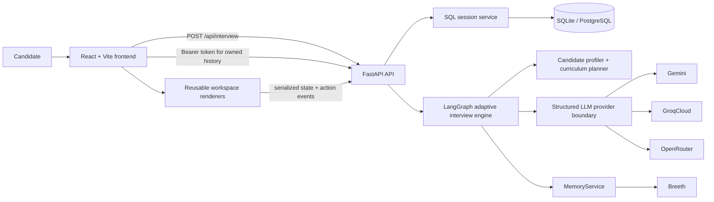

# BuzzPrep

**BuzzPrep** is Team **BuzzBees'** submission for the **The Interview Agent** hackathon: an adaptive technical interview simulator that evaluates both what a candidate **says** and what they **do** in a structured engineering workspace.

The core differentiator is simple: **BuzzPrep is not only a chatbot.** The interviewer can adapt to a candidate's explanation, curriculum history, and machine-readable workspace actions such as connecting components, changing configuration, editing code or prompts, running tasks, and submitting evidence.

## Live product

- Frontend: <https://buzzprep-web.vercel.app>
- API: <https://buzzprep-api.vercel.app>
- Health: <https://buzzprep-api.vercel.app/health>
- Required evaluator endpoint: `POST /api/interview`

The organizer endpoint remains public and does not require authentication or workspace data. Authentication, interview history, the interactive workspace, integrity telemetry, and voice controls are additive product features.

## What is implemented

- **31-day curriculum grounding** — the supplied curriculum remains deterministic application data and is the source of truth for interview topics.
- **Candidate-aware planning** — all 20 supplied candidate profiles can be profiled using role, experience, passed/failed/skipped missions, attempts, and learning signals.
- **Adaptive LangGraph interviewer** — question generation, answer evaluation, follow-up/deepen decisions, curriculum transitions, and final feedback run through a structured interview graph.
- **Hard completion invariant** — Python, not the LLM, enforces at least **8 questions across 4 distinct curriculum days**.
- **Evidence-aware workspace** — React Flow, Monaco, configuration, and inspection experiences emit structured candidate actions instead of relying on visual state alone.
- **Nine logical interaction types** — `system_canvas`, `configuration_lab`, `data_workbench`, `prompt_schema_editor`, `code_config_repair`, `logs_metrics_explorer`, `test_evaluation_runner`, `incident_simulator`, and `architecture_critique` are mapped to four reusable renderer families.
- **Persistent interview state** — SQLAlchemy stores sessions, ordered turns, coverage, current challenge, workspace snapshots, structured scores, completion state, ownership, timestamps, and integrity telemetry.
- **SQLite + PostgreSQL** — SQLite is the local default; deployed BuzzPrep uses standard PostgreSQL through Supabase's Postgres connection surface.
- **Structured LLM provider chain** — Gemini, GroqCloud, and OpenRouter use one validated interface with controlled availability fallback.
- **Breeth semantic memory** — high-signal observations are stored and retrieved within candidate/session scope; memory failure is explicitly non-fatal.
- **Public demo + authenticated product flow** — landing page, Magic Link authentication, dashboard, interview history, readiness flow, active interview, and persisted results are implemented.
- **Opt-in browser voice controls** — candidates can dictate answers where the browser exposes Speech Recognition and can enable interviewer read-aloud through Speech Synthesis.
- **Transparent integrity telemetry** — focus, tab visibility, fullscreen, and reconnect events are kept separate from semantic answer/workspace evidence.

## Architecture



The architecture deliberately separates deterministic responsibilities from model-generated reasoning:

- **Python owns:** request validation, persistence, candidate profiling, curriculum selection rules, coverage accounting, completion eligibility, ownership, and response schemas.
- **The LLM owns:** question wording, answer evaluation, adaptive probing, and final feedback inside validated structured outputs.
- **Breeth owns:** optional semantic recall of concise observations, never canonical interview state.
- **The frontend owns:** interaction rendering and candidate action capture, never backend scoring rules.

For the detailed component and request lifecycle, see [`docs/architecture.md`](docs/architecture.md).

## Product flows

### Public evaluator / demo

The required `POST /api/interview` endpoint works without authentication and without workspace data. An empty candidate object is also supported for a neutral evaluator-compatible profile.

The public browser demo can be started from `/demo/setup` and does not require a Supabase account.

### Authenticated product

When Supabase Auth is configured, a candidate can use Magic Link authentication and access:

- `/dashboard` — recent and active interviews;
- `/history` — full owned history;
- `/prep/new` — candidate setup;
- `/prep/:sessionId/readiness` — readiness checks;
- `/prep/:sessionId` — active interview;
- `/results/:sessionId` — persisted result.

The backend verifies the bearer token and associates new authenticated interviews with the verified Supabase user subject. The browser never supplies a trusted raw owner id.

### Active interview device requirement

The landing, auth, dashboard, history, and results experiences are responsive. Starting or resuming the full technical workspace requires a viewport of at least **960 CSS pixels** with a fine pointer. Smaller or touch-only devices receive a desktop requirement instead of a compressed workspace.

## Tech stack

### Frontend

- React 19
- TypeScript
- Vite 7
- React Router
- Zustand
- `@xyflow/react` / React Flow
- Monaco Editor
- Supabase JS
- Lucide icons
- Browser Web Speech APIs for optional dictation/read-aloud

### Backend

- Python 3.12+
- FastAPI
- Pydantic v2
- LangGraph
- SQLAlchemy 2
- psycopg 3
- HTTPX
- Breeth Python SDK

### Infrastructure

- Vercel — frontend and FastAPI deployment
- Supabase Postgres — deployed persistent state
- Supabase Auth — optional Magic Link identity and owned history
- Gemini / GroqCloud / OpenRouter — structured generation provider chain
- Breeth — optional semantic interview memory

## Repository layout

```text
BuzzPrep/
├── backend/
│   ├── app/
│   │   ├── api/           # interview + authenticated history routes
│   │   ├── auth/          # optional Supabase token verification
│   │   ├── curriculum/    # curriculum loading
│   │   ├── db/            # SQLAlchemy engine/session lifecycle
│   │   ├── interview/     # LangGraph engine, graph state, prompts, outputs
│   │   ├── llm/           # provider-neutral structured generation adapters
│   │   ├── memory/        # Breeth/No-op memory service boundary
│   │   ├── models/        # SQLAlchemy persistence models
│   │   ├── planning/      # deterministic interview planner
│   │   ├── profiling/     # candidate normalization/profiling
│   │   ├── schemas/       # API + workspace schemas
│   │   └── services/      # session/interviewer application boundaries
│   ├── scripts/           # live provider and memory smoke tests
│   ├── tests/
│   └── resources/         # deployment-safe copies of candidate/curriculum data
├── frontend/
│   └── src/
│       ├── auth/
│       ├── challenges/    # reusable renderer registry and implementations
│       ├── dashboard/
│       ├── marketing/
│       ├── prep/
│       └── workspace/     # serializable state + structured action events
├── docs/
├── hackathon-resources/   # supplied curriculum, candidates, technical spec
├── supabase/migrations/
└── .env.example
```

## Run locally on Windows

The canonical local configuration file is `repo-root/.env`.

```powershell
Copy-Item .env.example .env
```

Use two PowerShell terminals from the repository root.

### Backend

```powershell
cd backend
py -3.12 -m venv .venv
.\.venv\Scripts\Activate.ps1
python -m pip install -e ".[dev]"
python -m uvicorn app.main:app --reload
```

### Frontend

```powershell
cd frontend
npm ci
npm run dev
```

Open <http://127.0.0.1:5173>. Vite is configured to bind to IPv4 on Windows and proxies `/api` and `/health` to the local backend.

For a deterministic credential-free local interview:

```env
LLM_PROVIDER_CHAIN=
LLM_PROVIDER=fake
BREETH_ENABLED=false
```

A normal live run should use a configured real provider. BuzzPrep never silently falls back to fake AI.

Full environment, database, Supabase, provider, Vercel, and troubleshooting instructions are in [`docs/operations.md`](docs/operations.md).

## Required API contract

The organizer contract from [`hackathon-resources/technical-spec.md`](hackathon-resources/technical-spec.md) is preserved.

### Start

```http
POST /api/interview
Content-Type: application/json
```

```json
{
  "sessionId": "abc-123",
  "candidate": {}
}
```

Typical response:

```json
{
  "reply": "...",
  "done": false
}
```

### Continue

```json
{
  "sessionId": "abc-123",
  "message": "My technical explanation..."
}
```

The browser product may additionally attach workspace evidence and integrity events:

```json
{
  "sessionId": "abc-123",
  "message": "My technical explanation...",
  "workspace": {
    "version": 1,
    "challengeId": "day-16-initial",
    "nodes": [],
    "edges": [],
    "config": {},
    "events": []
  },
  "integrityEvents": []
}
```

Non-final responses can add `challenge` and `progress`; those are additive and never expose hidden scores, rubrics, answer keys, or future questions.

### Finish

```json
{
  "reply": "Interview completed.",
  "done": true,
  "feedback": {
    "summary": "...",
    "strengths": [],
    "gaps": [],
    "next": []
  }
}
```

### Authenticated history

These product routes require a valid configured Supabase bearer token and only return rows owned by the verified user:

```text
GET /api/me/interviews
GET /api/me/interviews/{sessionId}
```

Public evaluator sessions remain ownerless.

## Evidence, privacy, and voice behavior

BuzzPrep keeps three categories distinct:

1. **Interview state** — canonical SQL session/turn data.
2. **Semantic evidence** — candidate answers and meaningful workspace mutations used by the interview engine and optional Breeth memory.
3. **Integrity telemetry** — tab visibility, focus, fullscreen, and reconnect events stored separately from semantic evidence.

Simple node/edge selection is UI state and is **not** counted as candidate evidence.

Voice input is opt-in. BuzzPrep does not upload or store microphone audio in its backend. Dictation uses the browser's Speech Recognition implementation, so browser/OS/vendor behavior and support vary. Read-aloud uses browser Speech Synthesis. Typing remains available regardless of voice support.

## Verification

Backend gates:

```powershell
cd backend
.\.venv\Scripts\Activate.ps1
python -m pytest
python -m ruff check .
python -m compileall -q app tests scripts
```

Deterministic end-to-end interview:

```powershell
python -m pytest tests\test_e2e_interview.py -q
```

Frontend gate:

```powershell
cd frontend
npm ci
npm run build
```

Live provider/memory smoke scripts are intentionally outside normal pytest:

```powershell
cd backend
.\.venv\Scripts\Activate.ps1
python scripts\smoke_gemini.py
python scripts\smoke_structured_providers.py
python scripts\smoke_breeth.py
```

The production-finish release in PR #19 recorded **71 backend tests passing**, Ruff/compile checks passing, a successful frontend production build, successful live provider fallback and Breeth checks, persistent production sessions, and a full 8-question/4-day production completion. The later voice-controls commit is frontend-only.

## Deployment

BuzzPrep is split into independently deployable Vercel roots:

```powershell
cd backend
vercel

cd ..\frontend
vercel
```

The deployed backend should use a PostgreSQL `DATABASE_URL`; on serverless Vercel with Supabase, the transaction-pooler connection on port `6543` is supported directly. BuzzPrep detects that mode, disables psycopg automatic prepared statements, and uses `NullPool` so the external pooler remains responsible for connection reuse.

See [`docs/operations.md`](docs/operations.md) for the complete production configuration and validation checklist.

## Documentation

- [`docs/product-concept.md`](docs/product-concept.md) — implemented product model, flows, evidence model, and product boundaries.
- [`docs/architecture.md`](docs/architecture.md) — end-to-end system design, request lifecycles, state ownership, fallback, auth, and failure behavior.
- [`docs/curriculum-interactions.md`](docs/curriculum-interactions.md) — curriculum-wide challenge map for all 31 days.
- [`docs/operations.md`](docs/operations.md) — local setup, environment variables, Supabase/Postgres, Vercel, verification, and troubleshooting.
- [`docs/demo-guide.md`](docs/demo-guide.md) — concise hackathon/evaluator demo path and what to highlight.
- [`hackathon-resources/technical-spec.md`](hackathon-resources/technical-spec.md) — organizer-supplied API contract.

## Team BuzzBees

- **Ilma Khan**, Team Leader — [@ilmatech](https://github.com/ilmatech)
- **Amaan Syed** — [@amaansyed27](https://github.com/amaansyed27)

## License

[MIT](LICENSE)
