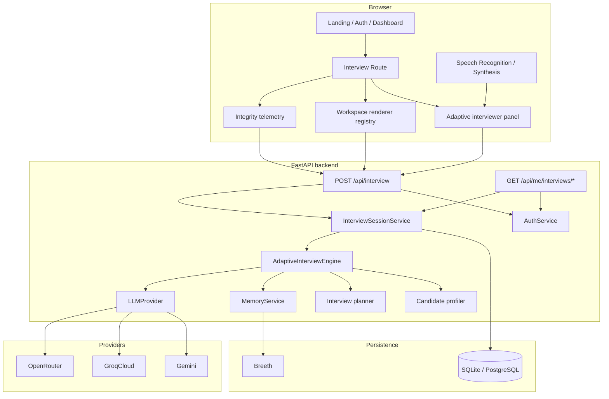
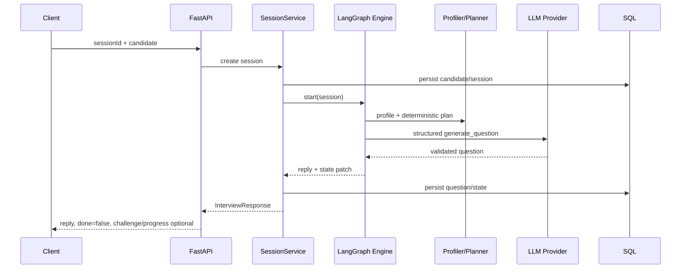
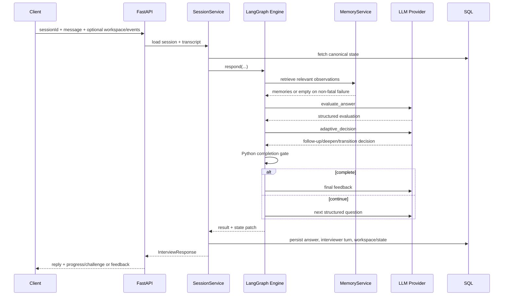

# BuzzPrep Architecture

This document describes the architecture implemented on the current BuzzPrep `main` branch. It focuses on system boundaries, state ownership, request lifecycles, evidence flow, authentication, provider fallback, and deployment behavior.

## Design goals

BuzzPrep is built around five architectural rules:

1. **Keep the organizer API stable.** `POST /api/interview` remains public and conversational even when the browser workspace is not used.
2. **Keep deterministic rules outside the LLM.** Candidate profiling, curriculum grounding, session state, ownership, coverage accounting, and the 8-question/4-day completion gate are Python responsibilities.
3. **Treat workspace actions as structured evidence.** The backend receives a serializable snapshot plus candidate mutation events rather than attempting to infer intent from UI pixels.
4. **Keep canonical state in SQL.** Optional semantic memory can improve recall, but it cannot replace exact interview/session state.
5. **Degrade optional dependencies safely.** Memory failure should not end an interview, and provider fallback should not hide invalid client requests.

## System overview



## Frontend architecture

The frontend is React 19 + TypeScript + Vite.

### Routing

`frontend/src/App.tsx` defines two product paths that converge on the same interview system.

Public routes include:

```text
/
/auth
/auth/callback
/demo/setup
/demo/:sessionId/readiness
/demo/:sessionId
/demo/:sessionId/results
```

Authenticated routes include:

```text
/dashboard
/history
/prep/new
/prep/:sessionId/readiness
/prep/:sessionId
/results/:sessionId
```

Authenticated routes are wrapped by `ProtectedRoute`, but the public demo remains independent of authentication.

### Interview state

The browser keeps presentation/interview state in `useInterviewStore` and workspace state in the dedicated Zustand workspace store.

The frontend does not own authoritative interview scoring or completion rules. It renders values returned by the backend and serializes candidate actions.

### Workspace store

`frontend/src/workspace/store.ts` manages curriculum-agnostic workspace state.

State includes:

- nodes;
- edges;
- UI selection;
- configuration;
- editor contents;
- structured submissions;
- candidate mutation events;
- undo history;
- active challenge id;
- initial/reset snapshot.

Candidate mutations emit events such as:

```text
add
remove
connect
disconnect
configure
edit
run
submit
undo
reset
```

Selection helpers such as `selectNode` and `selectEdges` update UI selection only and do not emit evidence events.

### Challenge renderer registry

`frontend/src/challenges/registry.ts` maps nine logical interaction types into four renderer families.

| Planner interaction type | Renderer family |
|---|---|
| `system_canvas` | canvas |
| `configuration_lab` | configuration |
| `prompt_schema_editor` | editor |
| `code_config_repair` | editor |
| `data_workbench` | inspection |
| `logs_metrics_explorer` | inspection |
| `test_evaluation_runner` | inspection |
| `incident_simulator` | inspection |
| `architecture_critique` | inspection |

The renderer families are implemented by:

- `SystemCanvas`;
- `ConfigurationLab`;
- `EditorChallenge`;
- `InspectionChallenge`.

This keeps curriculum logic out of presentation components and lets many curriculum days reuse the same interaction system.

### Voice controls

`frontend/src/ChatPanel.tsx` adds two optional browser-level capabilities:

- candidate dictation through `SpeechRecognition` / `webkitSpeechRecognition` when available;
- interviewer read-aloud through `speechSynthesis`.

The backend receives only the final text answer. BuzzPrep does not add an audio upload or audio persistence endpoint.

### Integrity telemetry

`frontend/src/prep/integrityTelemetry.ts` records a bounded queue of transparent browser-state events:

```text
tab_hidden
tab_visible
window_blur
window_focus
fullscreen_enter
fullscreen_exit
reconnect
```

Events are drained when an answer is submitted and restored to the queue if that network request fails.

Integrity telemetry is sent separately from workspace evidence.

### Desktop capability gate

The full active interview workspace requires:

```css
(min-width: 960px) and (pointer: fine)
```

This is a deliberate product constraint, not a backend constraint. Public API clients can call the backend from any device.

## Backend architecture

The backend is Python 3.12 + FastAPI + Pydantic + LangGraph + SQLAlchemy.

### Application startup

`backend/app/main.py`:

1. loads the repository-root `.env` without overriding process variables;
2. builds the database;
3. builds the optional memory service;
4. builds the configured LLM provider/provider chain;
5. builds the adaptive interview engine;
6. builds the optional authentication service;
7. creates compatible database tables/upgrades during lifespan startup;
8. registers interview/history routes and structured exception handlers.

`GET /health` returns a minimal service health response.

### API layer

The primary contract is:

```text
POST /api/interview
```

The request must contain exactly one of:

- `candidate` for a new session; or
- `message` for an existing session turn.

Optional fields include:

- `workspace`;
- `integrityEvents`.

The response always keeps the organizer-compatible `reply` and `done` fields, with final `feedback` when complete. Non-final product responses can additionally include `challenge` and `progress`.

Authenticated history lives under:

```text
GET /api/me/interviews
GET /api/me/interviews/{sessionId}
```

Those routes require a verified authenticated user.

## Session service and SQL state

SQL is the canonical source of interview truth.

`InterviewSession` persists:

- `session_id`;
- optional `owner_id`;
- raw candidate data;
- active/completed status;
- question and turn counts;
- covered curriculum days;
- current curriculum day/topic/challenge;
- workspace snapshot;
- structured scores;
- completion state;
- integrity telemetry;
- created/updated/completed timestamps.

`InterviewTurn` persists an ordered transcript using a `(session_id, sequence)` uniqueness constraint and stores:

- role;
- turn kind;
- content;
- optional structured payload;
- timestamp.

This makes a session recoverable across separate HTTP requests and separate application instances when they use the same database.

## Database modes

Local default:

```text
sqlite:///./buzzprep.db
```

Production can use PostgreSQL. `postgres://` and `postgresql://` URLs are normalized to psycopg 3 URLs.

When the configured PostgreSQL endpoint uses port `6543`, BuzzPrep treats it as a transaction-pooling endpoint, which is suitable for Supabase's transaction pooler in serverless environments:

- psycopg automatic prepared statements are disabled;
- SQLAlchemy uses `NullPool`;
- the external transaction pooler remains responsible for connection reuse.

## Candidate profiling and deterministic planning

Before adaptive wording begins, the backend derives a structured candidate profile from supplied candidate data.

Important profile signals include:

- candidate identity;
- role;
- experience;
- education;
- passed/failed/skipped days;
- first-try strengths;
- repeated-attempt/weaker days.

The planner then selects curriculum areas from the supplied curriculum and emits structured fields such as:

- day/topic;
- intent;
- difficulty;
- objectives/evidence expectations;
- interaction types;
- question budget.

The plan is deterministic for the same profile and curriculum data.

## LangGraph interview engine

`AdaptiveInterviewEngine` builds a graph with nodes for:

```text
prepare
retrieve_memory
evaluate_answer
adaptive_decision
completion_gate
select_area
generate_question
finalize_feedback
```

The graph separates first-turn behavior from conversation-turn behavior.

### Start request lifecycle



### Conversation-turn lifecycle



## Deterministic completion gate

The completion rule is a pure Python invariant:

```text
question_count >= 8
AND
len(unique covered curriculum days) >= 4
```

The adaptive model can influence *how* the interview proceeds, but it cannot bypass minimum coverage.

The area selector also prevents overusing a single day when remaining questions must introduce enough new curriculum days to satisfy the minimum.

## Structured LLM boundary

Every model task calls the same provider-neutral interface:

```text
generate_structured(
  task,
  system_prompt,
  context,
  output_schema
)
```

The output must validate against the original Pydantic model.

Current structured tasks include:

- question generation;
- answer evaluation;
- adaptive decision;
- final feedback.

### Provider configuration

If `LLM_PROVIDER_CHAIN` is set, providers are created in the configured order. The standard production chain is:

```text
gemini,groq,openrouter
```

Current model defaults/configuration are documented in `.env.example`.

### Fallback semantics

`FallbackLLMProvider` tries the next provider when the current provider has an availability/provider/structured-output failure.

It does **not** fall through when a request itself is rejected as invalid. That distinction prevents a malformed request from being misrepresented as a provider outage.

If every configured provider is unavailable, the backend returns a provider error instead of silently using fake AI.

The fake provider is only selected explicitly for tests or local demos.

## Semantic memory boundary

`MemoryService` keeps Breeth behind a narrow interface.

### Write scope

High-signal observations are written with:

- candidate id as Breeth end-user scope;
- session id as `group_id`;
- concise evidence text containing curriculum day and source/turn metadata.

### Retrieval scope

The engine retrieves a small number of relevant observations within the same candidate/session scope before generating adaptive context.

### Failure behavior

Memory exceptions are logged and converted to an empty result. The interview continues from SQL state.

This is intentional: semantic memory improves contextual recall but is not allowed to become a single point of failure.

## Workspace evidence boundary

The backend Pydantic workspace schema validates serialized state and event types before it reaches the interview engine.

The engine converts recent events into compact facts such as:

```text
added node X
connected A to B
configured timeout_ms to 1500
edited editor-code
ran evaluation
submitted task design-review
used undo
reset the workspace
```

Only supplied facts may be referenced as explicit workspace evidence in generated questions. If a model claims to use a fact that was not supplied, structured output validation fails.

## Authentication and ownership

Authentication is optional for `POST /api/interview` and mandatory for owned history.

When Supabase Auth is configured:

1. the frontend obtains an access token through Supabase Auth;
2. the backend receives it in `Authorization: Bearer ...`;
3. `SupabaseAuthService` verifies the token against the hosted `/auth/v1/user` endpoint using the project publishable key;
4. the verified user id becomes the trusted identity;
5. authenticated new sessions are associated with that owner;
6. history queries are filtered by that owner.

Invalid/expired tokens return an auth error. Auth-service network/platform failures return an auth-unavailable error.

Public evaluator sessions remain ownerless.

## Error model

FastAPI validation errors are normalized into the product error shape:

```json
{
  "error": {
    "code": "invalid_request",
    "message": "Malformed interview request",
    "details": []
  }
}
```

Session, authentication, and interview-engine errors use the same top-level `error` object with stable code/message fields.

The frontend converts HTTP/proxy/network/timeout failures into readable product errors and does not locally append a candidate answer if the backend request fails.

## Deployment architecture

Production currently uses two independent Vercel application roots:

```text
frontend/  -> buzzprep-web.vercel.app
backend/   -> buzzprep-api.vercel.app
```

The backend uses environment variables for:

- database connection;
- provider chain and API keys;
- Breeth configuration;
- Supabase Auth verification;
- allowed CORS origins.

The frontend receives only public configuration:

- backend API origin;
- Supabase project URL;
- Supabase publishable key;
- auth enable flag.

Secret/service-role credentials must never be exposed through `VITE_*` variables.

## Failure and degradation behavior

| Dependency / condition | Expected behavior |
|---|---|
| Breeth unavailable | log warning, continue without semantic memory |
| Primary LLM unavailable | try next configured real provider |
| All configured LLMs unavailable | return provider error; do not switch to fake |
| Invalid LLM/client request | surface error; do not mask via fallback |
| Browser Speech Recognition unavailable | disable voice input; typing still works |
| Browser Speech Synthesis unavailable | disable read-aloud; text still works |
| Auth token invalid | authenticated route/request fails clearly |
| Supabase Auth unavailable | return temporary auth-unavailable error |
| Frontend answer request times out | preserve local answer text/evidence for retry behavior |
| Memory absent | SQL transcript/session remains authoritative |
| Mobile/touch-only active interview | show desktop requirement instead of broken workspace |

## Key source files

| Area | Primary path |
|---|---|
| FastAPI app | `backend/app/main.py` |
| Interview API | `backend/app/api/interview.py` |
| Authenticated history | `backend/app/api/history.py` |
| Session persistence/service | `backend/app/services/session.py` |
| SQL models | `backend/app/models/interview.py` |
| Database lifecycle | `backend/app/db/database.py` |
| Candidate profiler | `backend/app/profiling/` |
| Curriculum loader | `backend/app/curriculum/` |
| Interview planner | `backend/app/planning/` |
| LangGraph engine | `backend/app/interview/engine.py` |
| Structured LLM adapters | `backend/app/llm/` |
| Breeth memory adapter | `backend/app/memory/breeth.py` |
| API schemas | `backend/app/schemas/` |
| Frontend routes | `frontend/src/App.tsx` |
| Interview API client | `frontend/src/interviewApi.ts` |
| Workspace state/events | `frontend/src/workspace/` |
| Renderer registry | `frontend/src/challenges/registry.ts` |
| Voice controls | `frontend/src/ChatPanel.tsx` |
| Integrity telemetry | `frontend/src/prep/integrityTelemetry.ts` |
| Supabase migrations | `supabase/migrations/` |
